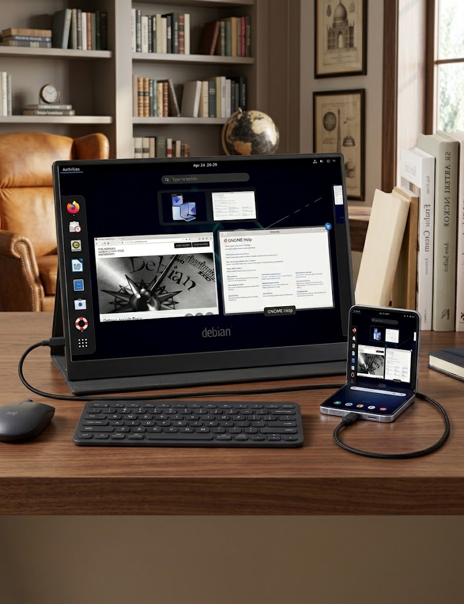

# FlipX

**Your Samsung never got DeX? Good — you don't need it.**

FlipX turns a Samsung Galaxy Z Flip — and every other Galaxy phone Samsung left
behind — into a complete Debian XFCE desktop workstation. On the phone itself,
on the little cover screen, or on a full-size external monitor with your phone
doubling as a precision trackpad.

If you've spent years watching other phones get desktop modes while yours got
nothing, stop waiting. This is that desktop — and paired with an external
display, it's better than DeX in the way that counts: a real Linux desktop out
front, and a giant trackpad already in your hand.

## Why FlipX

- **No DeX required.** Built for the long-suffering Samsung users whose phones
  never got a desktop mode — using Termux, Termux:X11 and proot Debian, all
  free software, no root, no hacks to the phone itself.
- **Flip-first.** The Z Flip's cover screen becomes a proper miniature desktop
  (correct aspect, never squashed), and folded shut the phone sips power while
  your session keeps running.
- **Your phone is the trackpad.** Plug into an external monitor and the phone's
  own screen becomes a large, precise trackpad for the desktop (Termux:X11
  Preferences → Touch Mode → Trackpad). Monitor, keyboard, mouse, trackpad — a
  full workstation from one phone and one cable.
- **Plays nice with Android.** One shared desktop layout (`1080x1920` phone,
  `1920x1080` external) for Android and Linux alike — plug in, tap Desktop
  Mode, run Linux. Closing Linux leaves the layout alone; Reset Screen is the
  only thing that returns the phone to native.

## Compatibility

| Device | Status |
|---|---|
| Galaxy Z Flip6 | ✅ Tested — main display, cover screen, external monitor |
| Galaxy Z Flip5 / Flip4 | ✅ Expected — same stack (cover screen via Good Lock MultiStar) |
| Other Galaxy phones without DeX | ✅ Expected — main display + external monitor flows |
| Fold, S series, tablets, any modern Android | ✅ Should work — the core setup is device-independent |

The core (Termux + Termux:X11 + proot Debian) runs anywhere. The Flip-specific
polish — clamshell cover screen, tall-screen handling — is where FlipX shines.

Feature requirements: cover screen needs Good Lock → MultiStar; external
monitor needs USB-C video out (or Smart View wireless); the ADB-backed scripts
prefer loopback (`127.0.0.1:5555` via `adb tcpip`) so they keep working with
WiFi off — see Plug-n-go below.

## Quick start

Prerequisites (Termux side): Termux + the Termux:X11 app, `proot-distro` with a
Debian container running XFCE, the `android-tools` package
(`pkg install android-tools`) with **Wireless debugging** enabled (once per
boot — see Loopback).

```bash
cp guistart restoggle adb_common.sh resetscreen guikill ~/
cp widgets/* ~/.shortcuts/   # needs the Termux:Widget app
chmod +x ~/guistart ~/restoggle ~/adb_common.sh ~/resetscreen ~/guikill ~/.shortcuts/*
./guistart
```

## Plug-n-go

1. Plug in the monitor. Tap the **Desktop Mode** widget: phone to `1080x1920`,
   every live external display to `1920x1080` (IDs are detected live — they
   change every replug).
2. Tap **Linux Desktop** (`guistart`): same shared layout, no conflicts.
3. **Kill Linux** (`guikill`) leaves the layout alone. **Reset Screen** is the
   only reset. Layout defaults to density 190, tunable via env, e.g.
   `FLIPX_DENSITY=360 ~/guistart`.

## Loopback ADB (solid, works with WiFi off)

Per boot: Wireless debugging ON once (needs any WiFi association — even a
no-internet dummy AP), tap the **ADB Loopback** widget: it arms
`adb tcpip 5555` and lands on `127.0.0.1:5555`. The toggle and WiFi can then go
off — everything keeps working until reboot. (No root can persist the listener;
`persist.adb.tcp.port` is refused on production builds.)

## What's in here

| File | What it does |
|---|---|
| `guistart` | One-shot desktop launcher: kills stale sessions, disables Android's phantom-process killer, applies the shared desktop layout to phone + live external displays, applies Termux:X11 prefs, starts the X server + XFCE. Leaves the layout alone on exit |
| `restoggle` | Background watcher: on phone-only use it forces the desktop layout while Termux:X11 is in the foreground and resets to native elsewhere; stands down completely while an external display is connected |
| `adb_common.sh` | Shared ADB target auto-detection (prefers loopback, never hardcodes ports — wireless ports rotate every restart) |
| `resetscreen` | One-shot reset of all displays to native (also a Termux widget) |
| `guikill` | Stops the desktop without touching the display layout |
| `widgets/Desktop Mode` | One-tap desktop layout for phone + monitor |
| `widgets/Reset Screen` | One-tap return to native |
| `widgets/ADB Loopback` | One-tap solid localhost ADB |
| `debian/google-chrome.desktop` | Chrome launcher with the flags proot needs (`--no-sandbox --test-type --disable-gpu`) |

## How it works

- `guistart` sets `displayResolutionMode:native`, so the X server adopts whatever
  screen it's on: full widescreen when open, proper square 720×748 on the cover
  screen when closed — never squashed.
- One shared layout (`1080x1920` phone at density 190, `1920x1080` external)
  serves Android and Linux, so nothing fights: `restoggle` only acts when no
  external display is present, and exiting Linux never resets.
- External display IDs increment every replug (6 → 13 → 15 → 16 observed), so
  all scripts detect them live via `dumpsys display` instead of hardcoding.

## Extras

**Chrome on ARM Debian** (inside the proot):

```bash
sudo apt install ./google-chrome-stable_current_arm64.deb   # from Google's site
cp debian/google-chrome.desktop ~/.local/share/applications/
cp debian/google-chrome.desktop ~/Desktop/   # optional desktop icon
```

Plain Chrome won't show a window under proot (no user namespaces, crashing GPU
process) — the bundled launcher bakes in the working flags.

**Mouse too twitchy?** The Termux:X11 pointer is raw 1:1 by default. Scale it
down live (tune `0.7` to taste):

```bash
DISPLAY=:0 xinput set-prop "Lorie mouse" "Coordinate Transformation Matrix" \
  0.7 0 0  0 0.7 0  0 0 1
```

(Make it permanent with an XFCE autostart entry once you're happy with the value.)
